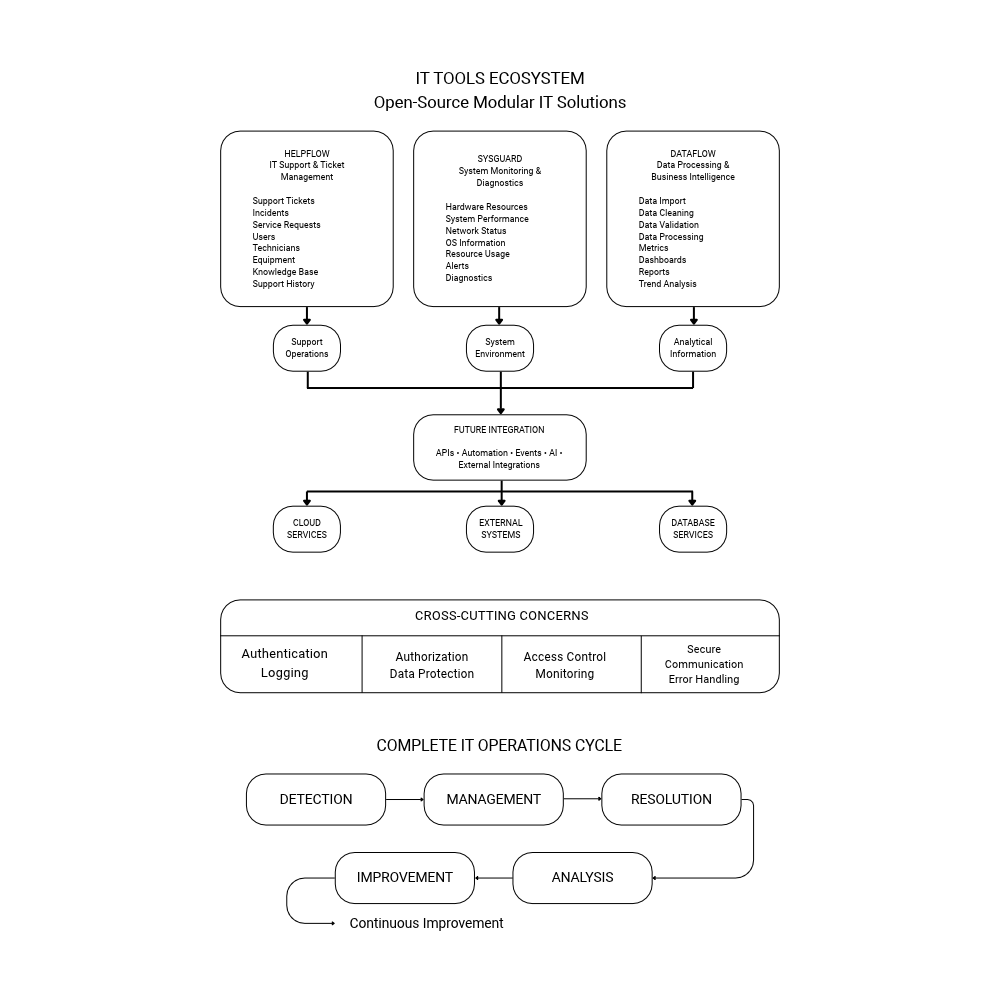

# IT Tools Ecosystem

Open-source ecosystem of modular tools for IT support, system monitoring, data processing, and business intelligence.

## Overview

**IT Tools Ecosystem** is a collection of modular and independently deployable tools designed to support IT professionals, support teams, and developers in managing technical operations more efficiently.

The ecosystem brings together three complementary areas:

- IT support and service management
- System monitoring and diagnostics
- Data processing and business intelligence

Each tool is designed to operate independently while also providing integration capabilities with the other components of the ecosystem.

The main goal is to provide practical, customizable, and deployable tools that can be used in real-world IT environments.

## Ecosystem Architecture



## Projects

### HelpFlow

**IT Support and Ticket Management Platform**

HelpFlow is a service management platform designed to organize and streamline IT support operations.

It enables support teams to manage requests, incidents, assets, resolutions, and service workflows in a centralized environment.

#### Main Features

- User and technician management
- Ticket creation and tracking
- Priority and impact management
- SLA monitoring
- Ticket history
- Comments and attachments
- Knowledge base
- Asset inventory
- Equipment management
- Dashboards and reports
- Role-based access control
- Audit logs
- Notifications
- REST API documentation

#### Support Workflow

```text
Ticket
   │
   ▼
Triage
   │
   ▼
Diagnosis
   │
   ▼
Service
   │
   ▼
Solution
   │
   ▼
Validation
   │
   ▼
Documentation
   │
   ▼
Closure
```

---

### DataFlow

**ETL and Business Intelligence Platform**

DataFlow is a data processing and analytics platform designed to collect, transform, validate, analyze, and visualize information from different sources.

It helps transform raw data into structured information, metrics, KPIs, and interactive dashboards.

#### Main Features

- CSV import
- Excel import
- API integrations
- SQL database connections
- Data cleaning
- Data validation
- Duplicate detection
- Data transformation
- Metrics creation
- KPI generation
- Interactive dashboards
- Data export
- Processing history
- Execution logs
- REST API

#### Data Pipeline

```text
CSV ─────────────┐
Excel ───────────┤
APIs ────────────┤
SQL Databases ───┤
                 ▼
              DataFlow
                 │
        ┌────────┼────────┐
        ▼        ▼        ▼
      Import  Cleaning  Validation
        │        │        │
        └────────┼────────┘
                 ▼
           Transformation
                 │
                 ▼
                ETL
                 │
                 ▼
        Database / Analytics
                 │
                 ▼
            Dashboards
```

---

### SysGuard

**System Monitoring and Diagnostics Tool**

SysGuard is a monitoring and diagnostics tool designed to collect system information, monitor computer resources, and assist in identifying performance, availability, and connectivity issues.

#### Main Features

- CPU monitoring
- RAM monitoring
- Disk monitoring
- Storage analysis
- Process monitoring
- Network information
- IP information
- Gateway monitoring
- DNS diagnostics
- Service monitoring
- Operating system information
- System uptime
- Performance alerts

#### Monitoring Architecture

```text
┌───────────────┐
│    Computer   │
└───────┬───────┘
        │
        ▼
┌───────────────┐
│ SysGuard Agent│
└───────┬───────┘
        │
   ┌────┼────┐
   ▼    ▼    ▼
 CPU   RAM  Disk
        │
        ▼
     Network
        │
        ▼
       API
        │
        ▼
    Dashboard
```

## Integration Between Tools

The ecosystem is designed around independent modules that can communicate and exchange information when required.

### Example Workflow

```text
                 ┌─────────────┐
                 │   SysGuard  │
                 └──────┬──────┘
                        │
                  Detects issue
                        │
                        ▼
                 ┌─────────────┐
                 │   HelpFlow  │
                 └──────┬──────┘
                        │
                 Creates ticket
                        │
                        ▼
                   Resolution
                        │
                        ▼
                 ┌─────────────┐
                 │   DataFlow  │
                 └──────┬──────┘
                        │
                        ▼
              Metrics & Reports
```

This architecture allows each project to evolve independently while maintaining the possibility of future ecosystem-level integration.

## Technology Stack

### Frontend

- React
- Next.js
- TypeScript
- Tailwind CSS

### Backend

- Node.js
- Express
- Python
- FastAPI
- Flask
- REST APIs

### Databases

- PostgreSQL
- MySQL
- SQL Server
- MongoDB
- Prisma ORM

### DevOps and Infrastructure

- Git
- GitHub
- Docker
- Docker Compose
- CI/CD
- Linux
- Cloud deployment

### Data and Analytics

- SQL
- ETL
- Power BI
- Power Query
- DAX

### Security

- JWT Authentication
- Role-Based Access Control (RBAC)
- HTTPS
- SSL/TLS
- API security
- Audit logs

## Installation

Each tool is designed to be independently deployable.

Docker and Docker Compose will be used to simplify local development and deployment.

### Example

```bash
git clone https://github.com/Laila-dAM/it-tools.git
cd it-tools
docker compose up
```

Individual tools may also provide their own installation and configuration instructions.

## Development Status

The project is currently under active development.

### Current Focus

- Project architecture
- Documentation
- Repository organization
- Core feature implementation
- Modular application structure
- Initial integration strategy

## Roadmap

### Phase 1 — Foundation

- Project documentation
- Architecture definition
- Repository structure
- Development standards

### Phase 2 — HelpFlow

- Authentication
- User and technician management
- Ticket management
- Asset inventory
- Support workflows
- SLA management

### Phase 3 — SysGuard

- Monitoring agent
- System monitoring
- Network diagnostics
- Service monitoring
- Performance alerts

### Phase 4 — DataFlow

- Data ingestion
- ETL processing
- Data validation
- Metrics and KPIs
- Interactive dashboards
- Analytics

### Phase 5 — Ecosystem Integration

- Shared authentication
- Inter-service communication
- Data exchange
- Cross-tool workflows
- Unified dashboards

## License

MIT License

## Author

Developed by **Laila de Araújo Mota**

GitHub:  
https://github.com/Laila-dAM
